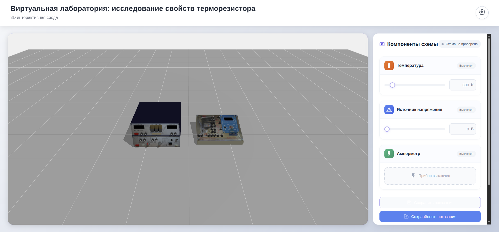
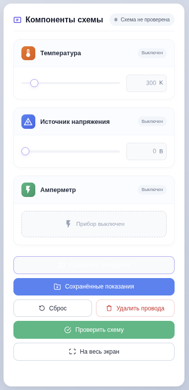
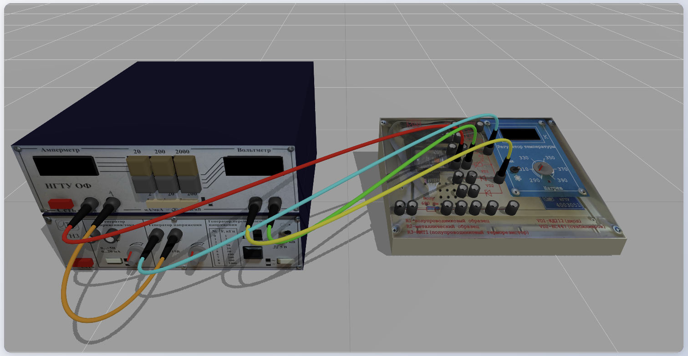
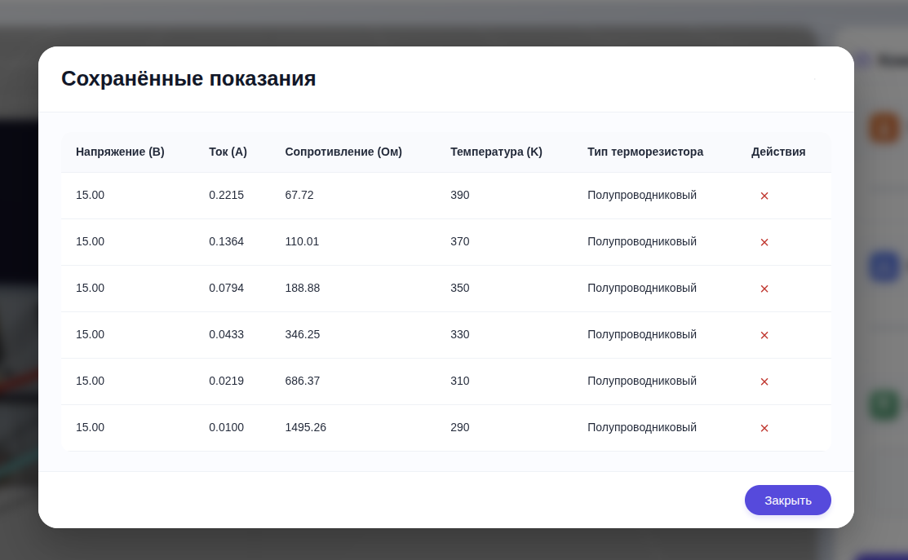
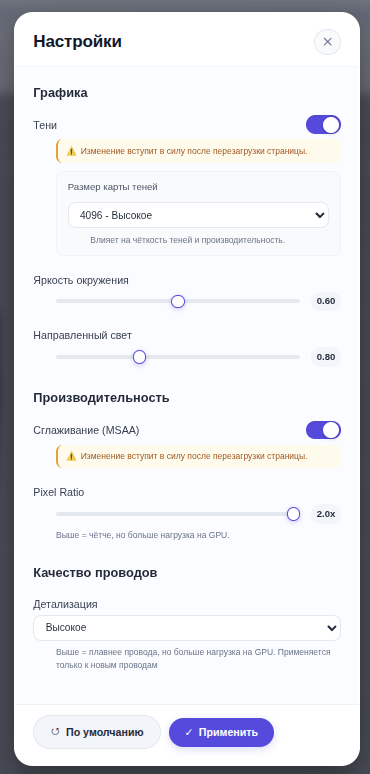

## 🔬 Виртуальная лаборатория: исследование свойств терморезистора

[](https://github.com/startsevd6/physics-virtual-work)
[](https://github.com/startsevd6/physics-virtual-work/releases)
[](https://physics-virtual-work.vercel.app/)

**Интерактивная 3D-среда** для изучения зависимости сопротивления терморезистора от температуры.  
Проект предназначен для **преподавателей физики** (визуальная демонстрация без кода) и **студентов ФЭН НГТУ** (практическое знакомство с электрическими схемами и терморезисторами).

  
*Основное окно программы: 3D-сцена с приборами и панель управления*

---

## 📚 Теоретическое введение

Терморезистор – элемент, сопротивление которого зависит от температуры.  
В лаборатории реализованы две модели:

- **Металлический терморезистор** – сопротивление линейно растёт с температурой:  
  `R(T) = R₀·[1 + α·(T – T₀)]`, α ≈ 0.0039…0.006 К⁻¹.
- **Полупроводниковый терморезистор** – сопротивление экспоненциально падает:  
  `R(T) = R₀·exp[B·(1/T – 1/T₀)]`, B ≈ 2000…5000 К.

Лабораторная работа позволяет:
- собрать электрическую схему, соединяя порты приборов трёхмерными проводами;
- проверить правильность сборки (автоматическое определение типа терморезистора);
- изменять напряжение источника (0–15 В) и температуру нагрева (290–390 К);
- сохранять показания (напряжение, ток, сопротивление, температура) в таблицу.

---

## 🖥️ Системные требования

- **Операционная система**: Windows 7 SP1 (32/64-bit) и новее
- **Процессор**: 1 ГГц, 1 ядро (рекомендуется 2+)
- **ОЗУ**: 1 ГБ (рекомендуется 2 ГБ)
- **Видеокарта**: поддержка WebGL (интегрированная Intel HD 4000+ или дискретная)
- **Дополнительно**: мышь, клавиатура

✅ *Протестировано на виртуальной машине: Windows 7 Корпоративная 32-bit SP1, 1024 МБ ОЗУ, 1 ядро Ryzen 7 5800H (без аппаратного 3D-ускорения).*

---

## 🧪 Функциональные возможности

| Возможность | Описание |
|-------------|----------|
| **3D-сцена** | Полноценное управление камерой (вращение, панорамирование, масштабирование) + **клавиатурное управление** (WASD – перемещение, Q/E – подъём/опускание) |
| **Сборка схемы** | Клик по порту → клик по порту другого прибора – создаётся изогнутый провод |
| **Удаление проводов** | Клик по проводу или по коннектору (чёрный наконечник) |
| **Включение приборов** | Красные кнопки – источник напряжения и амперметр, рычажок – терморезистор |
| **Регулировка** | Крутилки (или колёсико мыши) – напряжение 0–15 В и температура 290–390 К |
| **Проверка схемы** | Кнопка «Проверить схему» – определяет правильность сборки и тип терморезистора |
| **Сохранение показаний** | Таблица с U, I, R, T и типом терморезистора |
| **Настройки графики** | Тени, размер карты теней, яркость окружения и направленного света, сглаживание MSAA, pixel ratio, детализация проводов |
| **Веб-версия** | Доступна онлайн по ссылке (без установки) |
| **Полноэкранный режим** | Удобно для демонстрации на проекторе |

> 💡 *График вольт-амперной характеристики вынесен в отдельный инструмент и не входит в эту версию.*

---

## 🖱️ Управление в 3D-сцене

| Действие | Управление |
|----------|-------------|
| Вращение камеры | Зажать левую кнопку мыши и двигать |
| Перемещение (панорама) | Зажать правую кнопку мыши и двигать |
| Приближение / отдаление | Колёсико мыши |
| **Перемещение камеры (WASD)** | Клавиши W/A/S/D (движение относительно направления взгляда) |
| **Подъём / опускание камеры** | Q – подняться, E – опуститься |
| **Вращение крутилок** | Зажать левую кнопку на крутилке и двигать влево/вправо **или** колёсико мыши при наведении |
| **Выбор порта** | Левая кнопка мыши (первый порт → второй) |
| **Удаление провода** | Клик по проводу или коннектору |
| **Включение прибора** | Клик по красной кнопке или рычажку |

> 🔍 *При наведении на порт или крутилку курсор меняется – элемент готов к взаимодействию.*

---

## ⚙️ Настройки графики

В панели настроек (иконка шестерёнки в правом верхнем углу) доступны следующие параметры:

| Параметр | Описание |
|----------|----------|
| **Тени** | Включение/отключение отбрасывания теней (влияет на производительность) |
| **Размер карты теней** | 1024 (низкое), 2048 (среднее), 4096 (высокое) – качество теней |
| **Яркость окружения** | Интенсивность фонового света (0.2…1.0) |
| **Направленный свет** | Интенсивность основного источника света (0.2…2.0) |
| **Сглаживание (MSAA)** | Включение/отключение сглаживания (требует перезагрузки) |
| **Pixel Ratio** | 1x, 1.5x, 2x – разрешение рендеринга (выше = чётче, но тяжелее) |
| **Детализация проводов** | Низкая / Средняя / Высокая – влияет на гладкость изогнутых проводов (применяется к новым проводам) |

> ⚠️ *Некоторые изменения (сглаживание, размер карты теней) требуют перезагрузки приложения.*

---

## 📸 Скриншоты



*Карточки приборов с регуляторами*



*Создание провода между портами*



*Сохранённые измерения*



*Настройки*

---

## 📦 Установка и запуск

### Для пользователей (Windows)

1. Перейдите на страницу [Releases](https://github.com/startsevd6/physics-virtual-work/releases) или скачайте напрямую:
  - **Портативная версия** (не требует установки):  
    [VLR43_2.0.0.exe](https://github.com/startsevd6/physics-virtual-work/releases/download/v.2.0.0/VLR43_2.0.0.exe)
  - **Установщик** (создаст ярлыки):  
    [VLR43_Setup.2.0.0.exe](https://github.com/startsevd6/physics-virtual-work/releases/download/v.2.0.0/VLR43_Setup.2.0.0.exe)
2. Запустите скачанный файл. При установке следуйте инструкциям мастера.
3. После установки используйте ярлык на рабочем столе или в меню «Пуск».

### Для разработчиков (запуск из исходников)

```bash
git clone https://github.com/startsevd6/physics-virtual-work.git
cd physics-virtual-work
npm install
npm run dev          # Запуск Vite-сервера (http://localhost:5173)
npm run electron:dev # Запуск Electron-приложения в режиме разработки
npm run build        # Сборка веб-версии (папка dist)
npm run electron:build # Сборка Windows-установщика (требуется дополнительные настройки)
```
ℹ️ **Веб-версия** доступна онлайн: [https://physics-virtual-work.vercel.app/](https://physics-virtual-work.vercel.app/)

---

## 🛠️ Технологии и разработка

Проект написан с использованием современных веб-технологий и собран как настольное приложение на Electron.

| Компонент | Технология |
|-----------|------------|
| Фреймворк интерфейса | Vue 3 (Composition API) |
| 3D-движок | Three.js (GLTF-модели, кастомные шейдеры, кривые Безье для проводов) |
| Сборка веб-версии | Vite |
| Настольная обёртка | Electron 22 |
| Язык | TypeScript |
| Управление состоянием | Реактивные хуки Vue |

### Команды для разработки

- `npm run dev` – запуск дев-сервера Vite.
- `npm run build` – сборка веб-версии (`dist/`).
- `npm run electron:dev` – запуск Electron с горячей перезагрузкой.
- `npm run electron:build` – сборка `.exe` установщика (Windows).

---

## 👥 Авторы

Проект выполнен студентами **ПМИ-42** Новосибирского государственного технического университета при консультационной поддержке преподавателей физики.

### Разработчики

| Участник | Роль | Контакты / GitHub |
|----------|------|-------------------|
| **Старцев Дмитрий** | 3D-интеграция, логика проверки схем, провода, полный цикл сборки | [GitHub](https://github.com/startsevd6), 📧 startsevd6@gmail.com, ✈️ [@dmitrong](https://t.me/dmitrong) |
| **Пирожков Никита** | Пользовательский интерфейс, проверка схем, таблица показаний | [@CosmicConveyor](https://github.com/CosmicConveyor) |
| **Аширов Дамир** | 3D-моделирование, анимация приборов | [@DMR819](https://github.com/DMR819) |
| **Феофанов Александр** | Порты терморезистора, кликабельные крутилки и кнопки | [@1ssdfg45](https://github.com/1ssdfg45) |

### Научные консультанты

- **Баранов А.В.** – к.ф.-м.н., доцент (UI/UX, общее руководство)  
  [Профиль на сайте НГТУ](https://ciu.nstu.ru/kaf/persons/220/)
- **Христофоров В.В.** – к.т.н., доцент (физическая логика, корректность измерений)  
  [Профиль на сайте НГТУ](https://ciu.nstu.ru/kaf/persons/245/)

По вопросам и предложениям открывайте **Issue** в [репозитории GitHub](https://github.com/startsevd6/physics-virtual-work/issues) или пишите Дмитрию Старцеву.

---

## 📄 Лицензия

Проект является **открытым для использования в образовательных целях**.  
Код разрешено просматривать, модифицировать и распространять с обязательным указанием авторства.  
Коммерческое использование требует согласования с авторами.

> *Если вам нужна формальная лицензия (например, MIT), обратитесь к разработчикам.*

---

## 🙏 Благодарности

- Кафедра физики НГТУ за постановку задачи и методическую поддержку.
- Баранов А.В. и Христофоров В.В. за ценные консультации.
- Библиотеки с открытым исходным кодом: [Three.js](https://threejs.org/), [Vue 3](https://vuejs.org/), [Electron](https://www.electronjs.org/), [Vite](https://vitejs.dev/).
- Студенты ПМИ-42 за тестирование и отзывы.

---

## 🔗 Ссылки

- **Репозиторий GitHub**: [https://github.com/startsevd6/physics-virtual-work](https://github.com/startsevd6/physics-virtual-work)
- **Онлайн-демо (веб-версия)**: [https://physics-virtual-work.vercel.app/](https://physics-virtual-work.vercel.app/)
- **Скачать установщик (портативная версия)**: [VLR43_2.0.0.exe](https://github.com/startsevd6/physics-virtual-work/releases/download/v.2.0.0/VLR43_2.0.0.exe)
- **Скачать установщик (инсталлятор)**: [VLR43_Setup.2.0.0.exe](https://github.com/startsevd6/physics-virtual-work/releases/download/v.2.0.0/VLR43_Setup.2.0.0.exe)

---

*Новосибирск, 2026*